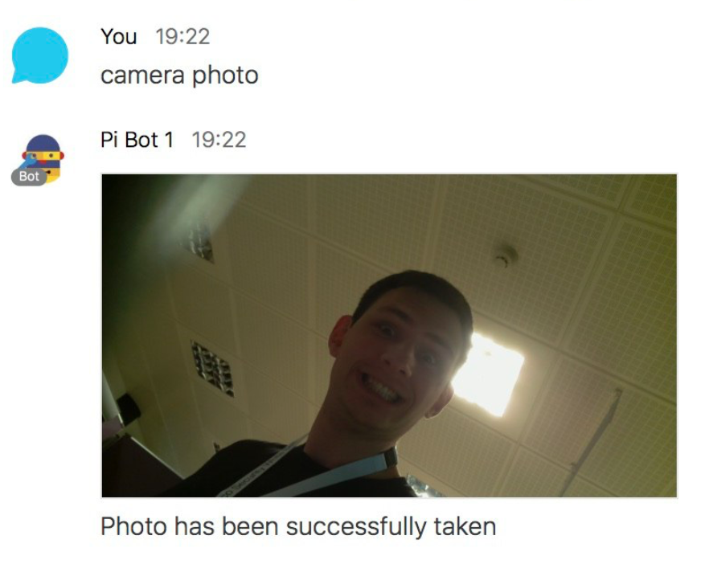

# Cisco Spark + Raspberry Pi

[Cisco Spark](https://www.ciscospark.com) bot to interact with components of [Raspberry Pi](https://www.raspberrypi.org).

Currently, the bot accepts commands to take a photo with a Raspberry Pi camera on a user's demand, as well as subscribe to automatic photo shooting on detected motion.

## Why

This is a simple educational project aimed to provide a clue about architecture of applications based on popular Cisco solution, Spark, and a world favourite mini-computer Raspberry Pi.

It was initially used at Cisco infrastructure team to inspire young students to information technologies. You are welcome to update the code, fork it and submit your ideas, as we're doing a lot of charity and educational projects and would be glad to reuse existing resources.

## Prerequisite

### Hardware

We use:

* Raspberry Pi 2b or 3b
* Official Raspberry Pi camera
* Motion sensor

The motion sensor is connected to the [GPIO port 23](https://pinout.xyz/pinout/pin16_gpio23) in our example, however you are free to choose any other port. Make sure to change ```app/config``` file accordingly.

#### Precautions

Make sure to remove static electricity, when playing with the Pi Camera and motion sensors, as they might be damaged.

Plug the camera in and out when the Pi board is not powered only, as doing otherwise could damage it.

### Software

* Python 3.6+
* Python dependencies
* [ngrok](https://ngrok.com/download) to create tunnels to localhost visible on the public internet.

You can install the dependencies manually or run an automated script to get this job done:

```shell
./setup.sh
```

### External Services

1. Sign up on [developer.ciscospark.com](https://developer.ciscospark.com) and [create a bot](https://developer.ciscospark.com/add-bot.html). Save the authorisation token into ```app/config.py``` (as bearer)
2. Sign up on [ngrok.com](https://ngrok.com) and follow guidelines to run the tunnel to port 8080.
3. Create a webhook.This will ensure that messages sent to your bot will be forwarded via ngrok to your localhost script. Make sure to enable test mode on and enter your bot information on the webpage.
  * Option 1. [Create a webhook](https://developer.ciscospark.com/endpoint-webhooks-post.html) for your Spark bot online.
  * Option 2. Just insert the authorisation token into ```app/config.py``` and the ngrok URL into ```target_url``` in ```app/register.py```. Then run it: ```python3.6 app/register.py```. If you see "OK", everything is good.

## Run Bot

1. Run ```./ngrok http 8080``` to create a tunnel
2. Run ```python3.6 app/main.py``` to launch the bot

Note: every time you run ngrok with a free plan, it changes the URL, which means that you need to reregister the bot. The easiest way is to simply insert the new URL into ```app/register.py``` and run it.

Now, you can access Cisco Spark on [web.ciscospark.com](https://web.ciscospark.com) or download the app to your device.

## Bot API

Bot responds to the commands stated below. Commands are case insensitive, which means that ```COMMAND```, ```command``` and ```CoMmanD``` are all the same thing. 

You can add a bot to a Spark space, or start an 1:1 chat - all cases are covered.

### Command Help

* ```help``` - Get the list of available commands and their description 

### Camera

* ```camera photo``` - Take a photo with a Raspberry Pi  camera and send it back as an attached image.

### Subsription

* ```subscribe security``` - Add your current Spark account to a database to receive security updates. It includes sending you photos taken by camera, when the motion sensor fires up.

* ```unsubscribe security``` - Opt out from the subscription.


#### Example




## File Structure

```
├── LICENSE              - License file
├── README.md            - Documentation
├── app                  - All Python code here
│   ├── bot.py           - 
│   ├── commands         - Each individual command is implemented as a module
│   │   ├── camera.py
│   │   ├── default.py   - Default reply if command is not found
│   │   ├── event.py
│   │   └── help.py
│   ├── config.py        - Bot configuration
│   ├── main.py          - Entry point, all operations start here
│   ├── motion.py        - A module for motion detector
│   ├── register.py      - Automatic registration of a webhook
│   ├── spark.py         - Implementation of Spark API
│   └── tmp              - Photos will be saved into this folder
├── ngrok                - The binary ngrok to let you work out of box
├── readme               - Materials for this README that do not affect the app
│   └── camera-photo.png
├── requirements.txt     - Python3 dependencies (list of packages)
└── setup.sh             - Automatic environment setup script
```

## References

* [Spark for developers](https://developer.ciscospark.com)
* [Raspberry Pi Pinout](https://pinout.xyz)

## License

This code and documentation are available under MIT license. See [license](LICENSE) for more details.

